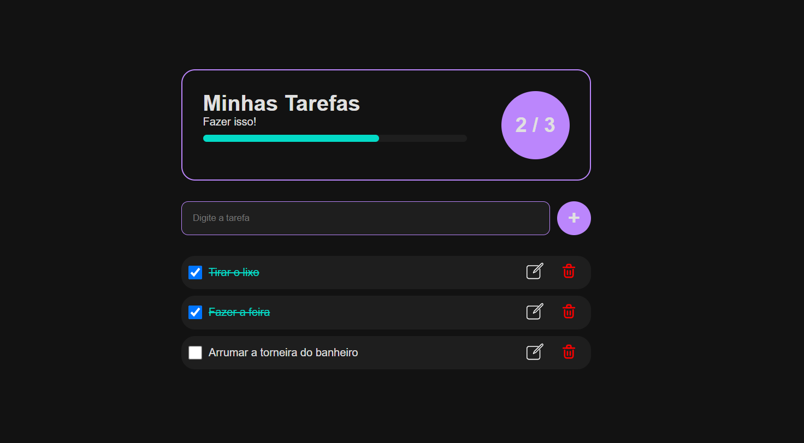

# Minhas Tarefas



## 📌 Sobre o Projeto

**Minhas Tarefas** é um aplicativo web simples e elegante para a organização de tarefas diárias. O projeto permite que os usuários adicionem, concluam e removam tarefas de forma intuitiva, proporcionando uma experiência fluida e moderna. Além disso, todas as tarefas são salvas no Local Storage, garantindo que não sejam perdidas ao recarregar a página.

🔗 **Acesse o projeto online:** [Minhas Tarefas](https://welder-task.vercel.app/)

## ✨ Funcionalidades

- 📌 **Adicionar tarefas** rapidamente na lista.
- ✅ **Marcar tarefas como concluídas** com um simples clique.
- 🗑️ **Remover tarefas** da lista.
- 📊 **Indicador de progresso**, mostrando a quantidade de tarefas concluídas.
- 🎨 **Interface Dark Mode** para uma melhor experiência visual.
- 💾 **Salvamento automático** no Local Storage para preservar as tarefas entre sessões.

## 🔮 Próximos Passos

- 📡 Armazenar tarefas em um banco de dados para acesso de qualquer dispositivo.

- 📱 Criar uma versão mobile-friendly.

- 🔔 Adicionar notificações para lembrar tarefas pendentes.

## 🛠️ Tecnologias Utilizadas

O projeto foi desenvolvido com as seguintes tecnologias:

- **HTML5**
- **CSS3**
- **JavaScript**
- **Vercel** (para hospedagem)

## 📂 Como Rodar o Projeto Localmente

Se quiser rodar o projeto na sua máquina, siga os passos abaixo:

```bash
# Clone este repositório
$ git clone https://github.com/welderqueiros/Meu-to-do

# Entre no diretório do projeto
$ cd minhas-tarefas

# Abra o arquivo index.html no navegador
```

## 🎨 Layout

O design do projeto segue uma abordagem minimalista e intuitiva, garantindo uma boa experiência ao usuário. Veja uma prévia abaixo:


## 🚀 Deploy na Vercel

O projeto está hospedado na Vercel e pode ser acessado através do link: [welder-task.vercel.app](https://welder-task.vercel.app/)

## 📄 Licença

Este projeto está sob a licença MIT. Sinta-se à vontade para usá-lo e modificá-lo como quiser!

---

💡 *Desenvolvido por [Welder](https://github.com/welderqueiros). Se gostou do projeto, deixe uma ⭐ no repositório!*

